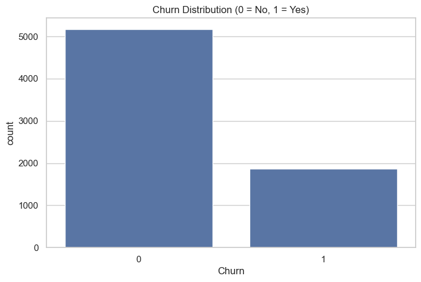
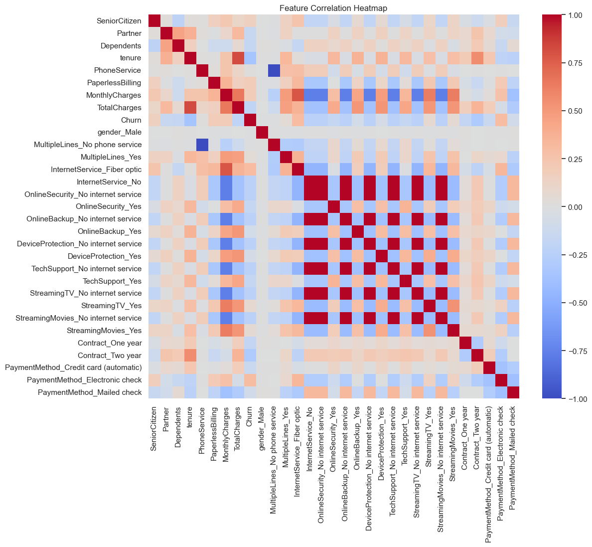
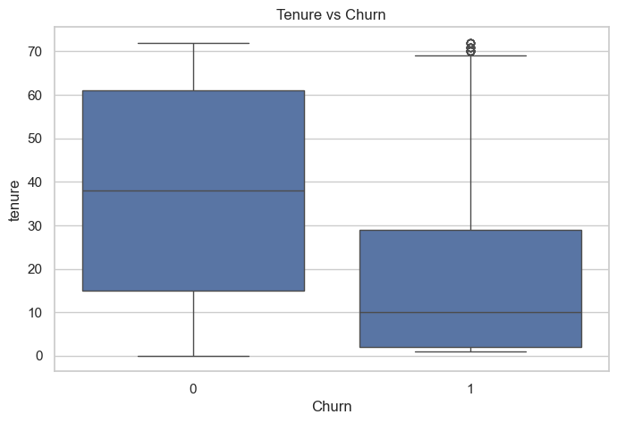
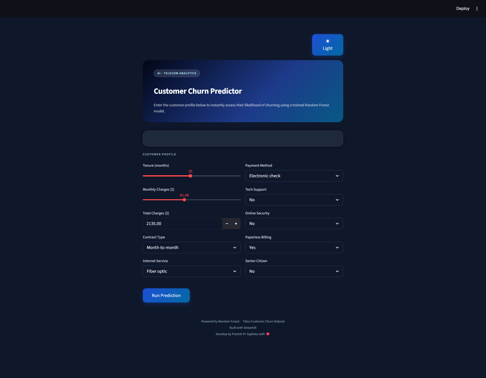
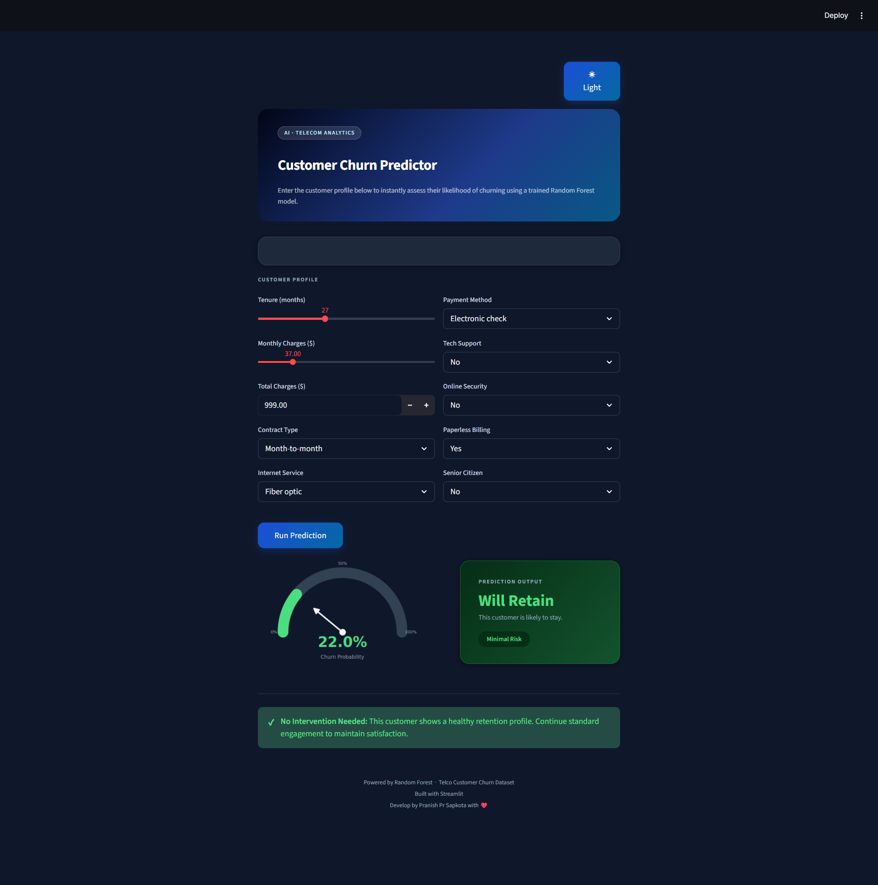
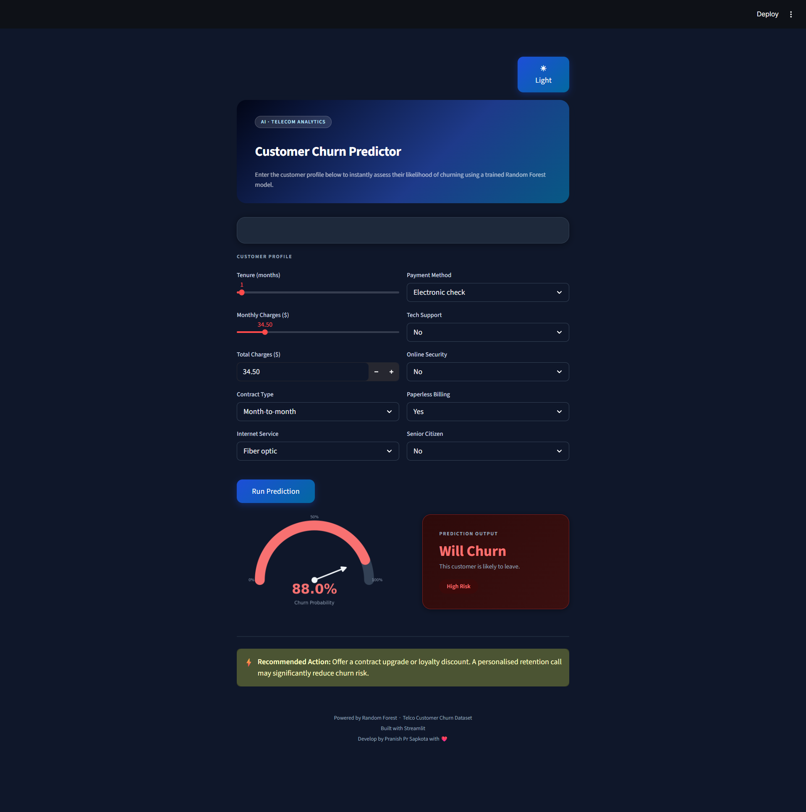

# 📊 Customer Churn Prediction (Telco Dataset)


[](https://www.python.org/)
[](https://streamlit.io/)
[](https://scikit-learn.org/stable/modules/generated/sklearn.ensemble.RandomForestClassifier.html)

An end-to-end **Machine Learning project** that predicts customer churn using a **Random Forest Classifier**. This project includes data preprocessing, exploratory data analysis (EDA), model building, evaluation, and deployment using a **Streamlit web app**.

---

## 🚀 Project Overview

Customer churn prediction helps businesses identify customers who are likely to leave. This project aims to:

* Analyze customer behavior
* Identify key churn factors
* Build a predictive ML model
* Provide a user-friendly interface for predictions

---

## 🧠 Model Used

* **Algorithm:** Random Forest Classifier
* **Advantages:**

  * Handles non-linear relationships
  * Reduces overfitting via ensemble learning
  * Works well with both categorical and numerical data
  * Provides feature importance

---

## 📁 Project Structure

```
├── README.md
├── requirements.txt
│
├── app
│   └── app.py
│
├── data
│   ├── processed
│   │   ├── churn_cleaned.csv
│   │   └── churn_final_eda.csv
│   │
│   └── raw
│       └── telco_churn.csv
│
├── image
│   ├── churn_distribution.png
│   ├── correlation_heatmap.png
│   ├── feature_correlation_with_churn.png
│   ├── MonthlyCharges_distribution.png
│   ├── monthlycharges_vs_churn.png
│   ├── pairplot.png
│   ├── tenure_distribution.png
│   ├── tenure_vs_churn.png
│   ├── TotalCharges_distribution.png
│   ├── totalcharges_vs_churn.png
│   │
│   └── screenshots
│       ├── demo.gif
│       ├── home.png
│       ├── prediction_i.png
│       └── prediction_ii.png
│
├── model
│   ├── churn_model.pkl
│   └── features.pkl
│
├── notebooks
│   └── 01_eda.ipynb
│
└── src
    ├── 01_data_preprocessing.py
    ├── 02_train_model.py
    └── 03_evaluate_model.py
```

---

## 📊 Exploratory Data Analysis (EDA)

Key insights:

* Customers with **low tenure** are more likely to churn
* Higher **monthly charges** increase churn probability
* **Contract type** plays a major role in retention

### 📌 Visualizations







---

## 🧪 Machine Learning Pipeline

### 1. Data Preprocessing

* Handling missing values
* Encoding categorical variables
* Feature selection

### 2. Model Training

* Random Forest Classifier
* Train-test split
* Hyperparameter tuning

### 3. Model Evaluation

* Accuracy score
* Confusion matrix
* Feature importance

---

## 💻 Streamlit Web App

Interactive web application for real-time churn prediction.

### 🎥 Demo


### 🖼️ Screenshots

**Home Page**


**Prediction Interface**




---

## ⚙️ Installation & Setup

### 1. Clone the repository

```
git clone https://github.com/Pranish-Sapkota/customer-churn-prediction.git
cd customer-churn-prediction
```

### 2. Create virtual environment

```
python -m venv venv
source venv/bin/activate     # Linux/Mac
venv\Scripts\activate        # Windows
```

### 3. Install dependencies

```
pip install -r requirements.txt
```

### 4. Run the application

```
streamlit run app/app.py
```

---

## 📦 Requirements

* streamlit
* pandas
* numpy
* scikit-learn
* matplotlib
* seaborn
* plotly

---

## 📌 Future Improvements

* Deploy on cloud (Streamlit Cloud / AWS / Render)
* Add SHAP for model explainability
* Improve UI/UX
* Experiment with XGBoost / LightGBM

---

## 🤝 Contributing

Contributions are welcome. Feel free to fork this repository and submit a pull request.

---

## 📧 Contact

**Pranish Sapkota**
GitHub: https://github.com/Pranish-Sapkota

---

## ⭐ Support

If you found this project useful, please give it a ⭐ on GitHub!
